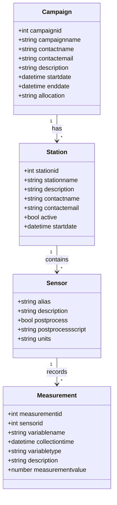

# Upstream API
[](https://doi.org/10.5281/zenodo.17664688)


A RESTful API service for managing environmental sensor data and campaigns.

## Installation & Setup

1. Clone the repository
2. Install dependencies (Docker and Docker Compose required)
3. Create a virtual environment and install dependencies:
   ```bash
   python -m venv .venv
   source .venv/bin/activate
   pip install -r requirements.txt
   pip install -r requirements-dev.txt
   ```
4. Create a `.env` file and set the environment variables. The sample defaults target a local Postgres instance (`localhost:5432`). If you want to connect to the Pods database instead, uncomment and populate the `PODS_DB_*` block in `.env.sample` (which also overrides `DATABASE_URL`):
   ```bash
   cp .env.sample .env
   ```
5. Build and run with Docker (recommended for local development):

   ```bash
   # Build the API image defined by Dockerfile (installs requirements into the container)
   docker compose build

   # Start API + database using the default stack
   docker compose up -d

   # Use an existing Postgres instance instead of the bundled db container
   # (ensure DATABASE_URL in .env points at the remote service)
   docker compose up -d --no-deps web
   ```

   The `web` service entrypoint waits for Postgres, then executes the default command—which runs `alembic upgrade heads` followed by Uvicorn on port 8000.

   For the slimmer dev stack in `docker-compose.dev.yml`, which targets whichever database `DATABASE_URL` references (Pods or local), start the service:

   ```bash
   # Launch only the API container; it will connect using DATABASE_URL from .env
   docker compose -f docker-compose.dev.yml up -d
   ```

   > Tip: the dev file no longer provisions a local Postgres container. Use the default `docker compose up -d` if you need an isolated local database for testing.

6. Optional: Run the API directly (without Docker) after installing dependencies:

   ```bash
   alembic upgrade heads
   fastapi dev app/main.py
   ```

## CKAN Integration

As of this release CKAN registration is handled entirely in the Upstream UI. The API retains the publish/unpublish endpoints only to persist station metadata (`is_published` and `published_at`) after the UI finishes updating CKAN directly. No CKAN-specific configuration is required on the API service.

## Core API Endpoints

The service is mounted at `/api/v1`. Common read operations:

- `GET /api/v1/campaigns` — paginate campaigns, supports filters via query parameters
- `GET /api/v1/campaigns/{campaign_id}` — fetch campaign details including station summary
- `GET /api/v1/campaigns/{campaign_id}/stations` — list stations for a campaign
- `GET /api/v1/campaigns/{campaign_id}/stations/{station_id}` — station metadata plus sensor list
- `GET /api/v1/campaigns/{campaign_id}/stations/{station_id}/sensors` — enumerate sensors (filtering and sorting available)
- `GET /api/v1/campaigns/{campaign_id}/stations/{station_id}/sensors/{sensor_id}/measurements` — retrieve measurements for a sensor

An interactive schema browser is available at `https://<host>/docs` (for example `https://infordisaster.pods.tacc.tapis.io/docs`).

## On-premise Environment

### Setting up environments

1. SSH to the VM with your TACC credentials:

   ```bash
   ssh <tacc_username>@upstream-dso.tacc.utexas.edu
   ```

2. Switch to root:

   ```bash
   sudo su
   ```

3. Enter to the prod directory or dev directory depending on what you want to do:

   ```bash
   cd ~/upstream-dev
   cd ~/upstream-prod
   ```

4. Change the IMAGE_TAG (commit hash, e.g. sha-a0fe1e7) in the .env file. You can find [here](https://github.com/In-For-Disaster-Analytics/upstream-docker/pkgs/container/upstream-docker) the latest commit hash.

   ```bash
   vim .env
   ```

5. Restart the containers:

   ```bash
   docker-compose up -d
   ```

## Deployment

There are two instances running on upstream-dso.tacc.utexas.edu:

- **Production**: https://upstream-dso.tacc.utexas.edu/docs/
- **Development**: https://upstream-dso.tacc.utexas.edu/dev/docs/

## Database Migrations

The project uses Alembic for database migrations. Key commands:

```bash
# Create a new migration
alembic revision --autogenerate -m "description"

# Apply migrations (run all heads)
alembic upgrade heads

# Rollback last migration
alembic downgrade -1

# View migration history
alembic history
```

## Seeding Development Data via API

The Alembic migrations insert sample campaigns, stations, sensors, and hourly measurements directly into the database. For workflows that need to exercise the API instead, use the helper script `scripts/seed_api_data.py`:

```bash
# Activate your virtualenv and ensure the API is running (defaults to http://localhost:8000).
python scripts/seed_api_data.py \
  --base-url http://localhost:8000/api/v1 \
  --token dev-token
```

The script:

- Creates the two sample campaigns and their associated stations if they are missing.
- Uploads sensors and 24 hours of hourly measurements for each station via the CSV upload endpoint.
- Accepts `--hours` to control the measurement window, `--dry-run` to preview actions, and `--skip-measurements` to load only metadata.

By default an Authorization header (`Bearer dev-token`) is sent; set `API_BEARER_TOKEN` or pass `--token` to supply a different credential, and `TAPIS_TOKEN` if you need the script to forward a real Tapis token.

## Database Schema

The following diagram shows the relationships between the main entities in the system:



```

```
