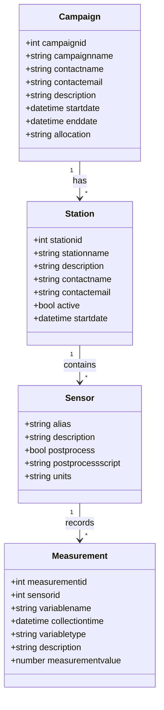

# Upstream API

A RESTful API service for managing environmental sensor data and campaigns.

## Installation & Setup

1. Clone the repository
2. Install dependencies (Docker and Docker Compose required)
3. Create a virtual environment and install dependencies:
   ```bash
   python -m venv .venv
   source .venv/bin/activate
   pip install -r requirements.txt
   pip install -r requirements-dev.txt
   ```
4. Create a `.env` file and set the environment variables. The sample defaults target a local Postgres instance (`localhost:5432`). If you want to connect to the Pods database instead, uncomment and populate the `PODS_DB_*` block in `.env.sample` (which also overrides `DATABASE_URL`):
   ```bash
   cp .env.sample .env
   ```
5. Build and run with Docker (recommended for local development):

   ```bash
   # Build the API image defined by Dockerfile (installs requirements into the container)
   docker compose build

   # Start API + database using the default stack
   docker compose up -d

   # Use an existing Postgres instance instead of the bundled db container
   # (ensure DATABASE_URL in .env points at the remote service)
   docker compose up -d --no-deps web
   ```

   The `web` service entrypoint waits for Postgres, then executes the default command—which runs `alembic upgrade heads` followed by Uvicorn on port 8000.

   For the slimmer dev stack in `docker-compose.dev.yml`, which targets whichever database `DATABASE_URL` references (Pods or local), start the service:

   ```bash
   # Launch only the API container; it will connect using DATABASE_URL from .env
   docker compose -f docker-compose.dev.yml up -d
   ```

   > Tip: the dev file no longer provisions a local Postgres container. Use the default `docker compose up -d` if you need an isolated local database for testing.

6. Optional: Run the API directly (without Docker) after installing dependencies:

   ```bash
   alembic upgrade heads
   fastapi dev app/main.py
   ```

## On-premise Environment

### Setting up environments

1. SSH to the VM with your TACC credentials:

   ```bash
   ssh <tacc_username>@upstream-dso.tacc.utexas.edu
   ```

2. Switch to root:

   ```bash
   sudo su
   ```

3. Enter to the prod directory or dev directory depending on what you want to do:

   ```bash
   cd ~/upstream-dev
   cd ~/upstream-prod
   ```

4. Change the IMAGE_TAG (commit hash, e.g. sha-a0fe1e7) in the .env file. You can find [here](https://github.com/In-For-Disaster-Analytics/upstream-docker/pkgs/container/upstream-docker) the latest commit hash.

   ```bash
   vim .env
   ```

5. Restart the containers:

   ```bash
   docker-compose up -d
   ```

## Deployment

There are two instances running on upstream-dso.tacc.utexas.edu:

- **Production**: https://upstream-dso.tacc.utexas.edu/docs/
- **Development**: https://upstream-dso.tacc.utexas.edu/dev/docs/

## Database Migrations

The project uses Alembic for database migrations. Key commands:

```bash
# Create a new migration
alembic revision --autogenerate -m "description"

# Apply migrations (run all heads)
alembic upgrade heads

# Rollback last migration
alembic downgrade -1

# View migration history
alembic history
```

## Database Schema

The following diagram shows the relationships between the main entities in the system:



```

```
